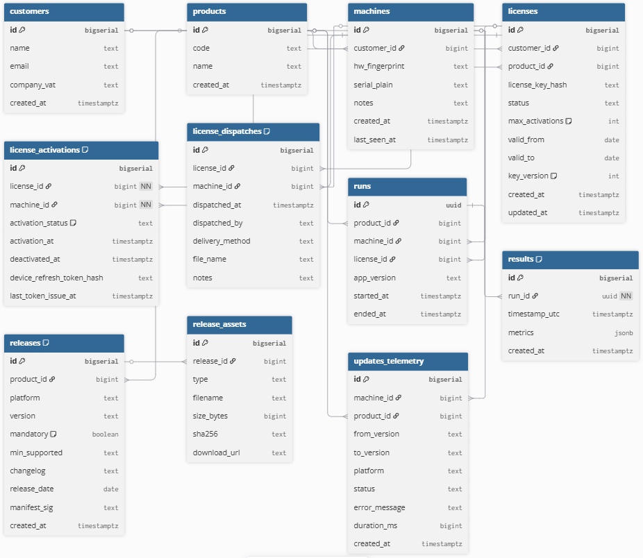

# Licencia algorítmica HMAC

## 1) Concepto general
Generas en tu máquina un **código de licencia** aplicando un **HMAC** (una «firma» basada en una clave secreta) sobre el **número de serie** del equipo.  
Ese `license_code` + el `machine_serial` se incluyen en un archivo `license.lic` que entregas al cliente.  
El `.exe` del cliente lleva la **misma clave** (embebida/ofuscada) y recalcula la operación para comprobar que la licencia es auténtica.

## 2) ¿Cómo debe ser la clave secreta?
Debe se alearotia y larga, mínimo de 32 bytes.

Ejemplo:

- Hex (64 hex chars):
f3b4c2d9a7e3f0b12c4d5e6f7a8b9c0d3e4f5a6b7c8d9e0f1a2b3c4d5e6f7a8

- Base64 URL-safe:
8O0wLZn6PwssTVXm96iewNO5PWmrfI2eDxoKzxNW5n6g

## 3) ¿Cómo se genera el número de licencia?
Generación:
- license_code = Base32( HMAC_SHA256( secret_key, machine_serial ) )

Recálculo:

- expected_code = Base32( HMAC_SHA256( secret_key_embebido, machine_serial_leído ) )
- verificación -> ( expected_code == license_code_del_.lic ) ? válida : inválida


## 4) ¿Qué contiene el `license.lic`?
El archivo que entregas al cliente debe incluir al menos:

- `product` → qué producto cubre.
- `machine_serial` → número de serie de la máquina autorizada.
- `license_code` → el código generado por ti (resultado del HMAC).

Campos opcionales que conviene incluir:
- `valid_from`, `valid_to` → fechas de validez.
- `issued_to` → cliente o institución.
- `key_version` → versión de la clave para permitir rotación futura.

Formato sugerido: JSON (archivo de texto) colocado en una ruta conocida, por ejemplo:
```
%APPDATA%\Dikoin\license.lic
```

---

## 5) Qué hace el `.exe` cuando detecta la máquina
1. **Leer número de serie**: obtiene el `machine_serial` desde la máquina física (por puerto serie / USB).
2. **Cargar `license.lic`**: lee el JSON desde la ruta acordada.
3. **Validaciones básicas**:
   - `product` coincide con el producto del exe.
   - `machine_serial` del `.lic` coincide con el leído del equipo.
4. **Recalcular `license_code`**: usando la clave secreta embebida y el `machine_serial`.
5. **Comparar**:
   - Si el código recalculado **coincide** con `license_code` del `.lic` → **licencia válida** → activar el software.
   - Si **no coincide** → **licencia inválida** → bloquear y avisar al usuario.

Acciones adicionales:
- Si la verificación es exitosa, guardar un `activated.json` local (flag de activación) para no revalidar siempre.
- Si hay Internet, opcionalmente enviar `POST /devices/heartbeat` a la API con `{serial, license_code, status}` para auditoría.

---

## 6) Quién tiene qué y dónde
- **Tú (fabricante)**:
  - **Secret**: la clave maestra, generada y guardada en tu máquina segura. (Siempre es la misma)
  - Herramienta local para generar `license_code` y producir `license.lic`.
  - Registro en BD (opcional) de qué `.lic` has emitido para qué `machine_serial`.

- **Cliente**:
  - `Setup.exe` (tu programa).
  - `license.lic` (contiene `machine_serial` + `license_code`) colocado en la ruta acordada.

- **El EXE**:
  - Contiene la **clave secreta embebida/ofuscada** para verificar licencias offline.

---

## Esquema visual (flujo)

```
[ Tú: Generador local ] 
    └─> 1) Tienes SECRET (guardado seguro)
    └─> 2) Generas license_code = HMAC(SECRET, machine_serial)
    └─> 3) Creas license.lic (JSON):
           { product, machine_serial, license_code, key_version, valid_from, valid_to }
    └─> 4) Entregas: Setup.exe + license.lic  → Cliente

[ Cliente: al instalar y ejecutar ]
    └─> A) EXE lee machine_serial desde la máquina física
    └─> B) EXE carga license.lic desde %APPDATA% o carpeta del programa
    └─> C) EXE recupera SECRET_embebido (ofuscado)
    └─> D) EXE recalcula expected = HMAC(SECRET_embebido, machine_serial)
    └─> E) Si expected == license_code del .lic → ACTIVADO
           └─> Guarda activated.json localmente y permite usar
           └─> (Opcional) Si hay Internet → POST /devices/heartbeat (serial, license_code, estado)
       Si NO → mostrar error: “Licencia inválida / serial no coincide / caducada”
```

---

# Esquema de base de datos


https://dbdiagram.io/d

Project DikoinAPI {
  database_type: "PostgreSQL"
}

/* === Catálogos === */
Table customers {
  id           bigserial [pk]
  name         text
  email        text
  company_vat  text
  created_at   timestamptz
}

Table products {
  id         bigserial [pk]
  code       text [unique] // p.ej. 'IT032'
  name       text
  created_at timestamptz
}

/* === Máquinas y licencias === */
Table machines {
  id             bigserial [pk]
  customer_id    bigint [ref: > customers.id]
  hw_fingerprint text    [unique] // sha256:...
  serial_plain   text             // número de serie legible
  notes          text
  created_at     timestamptz
  last_seen_at   timestamptz
}

Table licenses {
  id                bigserial [pk]
  customer_id       bigint  [ref: > customers.id]
  product_id        bigint  [ref: > products.id]
  license_key_hash  text    [unique] // hash del código de licencia
  status            text              // 'active'|'revoked'|'expired'|'trial'
  max_activations   int     [default: 1]
  valid_from        date
  valid_to          date
  key_version       int     [default: 1]
  created_at        timestamptz
  updated_at        timestamptz
}

/* === Asignaciones y uso de licencias === */
Table license_activations {
  id                       bigserial [pk]
  license_id               bigint [ref: > licenses.id, not null]
  machine_id               bigint [ref: > machines.id, not null]
  activation_status        text   [default: 'active'] // 'active'|'deactivated'|'blocked'
  activation_at            timestamptz
  deactivated_at           timestamptz
  device_refresh_token_hash text
  last_token_issue_at      timestamptz

  indexes {
    (license_id, machine_id) [unique]
  }
}

/* === NUEVA TABLA: registro de licencias enviadas === */
Table license_dispatches {
  id             bigserial [pk]
  license_id     bigint [ref: > licenses.id]
  machine_id     bigint [ref: > machines.id]
  dispatched_at  timestamptz
  dispatched_by  text          // nombre o correo del técnico que la generó
  delivery_method text         // 'email'|'usb'|'manual'
  file_name      text          // nombre del archivo .lic enviado
  notes          text

  indexes {
    (license_id, machine_id) [unique]
  }
}

/* === Sesiones y resultados === */
Table runs {
  id          uuid [pk]
  product_id  bigint [ref: > products.id]
  machine_id  bigint [ref: > machines.id]
  license_id  bigint [ref: > licenses.id]
  app_version text
  started_at  timestamptz
  ended_at    timestamptz
}

Table results {
  id            bigserial [pk]
  run_id        uuid [ref: > runs.id, not null]
  timestamp_utc timestamptz
  metrics       jsonb
  created_at    timestamptz

  indexes {
    run_id
    timestamp_utc
    metrics [type: gin]
  }
}

/* === Actualizaciones del software === */
Table releases {
  id            bigserial [pk]
  product_id    bigint  [ref: > products.id]
  platform      text
  version       text
  mandatory     boolean [default: false]
  min_supported text
  changelog     text
  release_date  date
  manifest_sig  text
  created_at    timestamptz

  indexes {
    (product_id, platform, version) [unique]
  }
}

Table release_assets {
  id          bigserial [pk]
  release_id  bigint [ref: > releases.id]
  type        text
  filename    text
  size_bytes  bigint
  sha256      text
  download_url text
}

/* === Telemetría y auditoría === */
Table updates_telemetry {
  id           bigserial [pk]
  machine_id   bigint [ref: > machines.id]
  product_id   bigint [ref: > products.id]
  from_version text
  to_version   text
  platform     text
  status       text
  error_message text
  duration_ms  bigint
  created_at   timestamptz
}


---

# API
[ .exe cliente ] (Si hay conexión)

     │
     ├──▶ Verifica licencia local (.lic)
     │
     ├──▶ POST /licenses/verify
     │        • Envía: { product, machine_serial, license_code, app_version }
     │        • Recibe: { valid, message, license_info }
     │
     ├──▶ POST /runs/start
     │        • Crea una nueva sesión de práctica.
     │
     │     ├──▶ POST /runs/{id}/results
     │     │        • Envía datos periódicos de la práctica (metrics JSON).
     │     │
     │     └──▶ POST /runs/{id}/finish
     │              • Finaliza la sesión de práctica.
     │
     ├──▶ GET /updates/check
     │        • Consulta si hay una nueva versión disponible.
     │
     │     └──▶ POST /updates/telemetry
     │              • Envía reporte de instalación o error tras la actualización.
     │
     └──▶ (opcional) POST /machines/heartbeat
              • Envía { machine_serial, app_version, license_code } para mantener vivo el registro de actividad.
